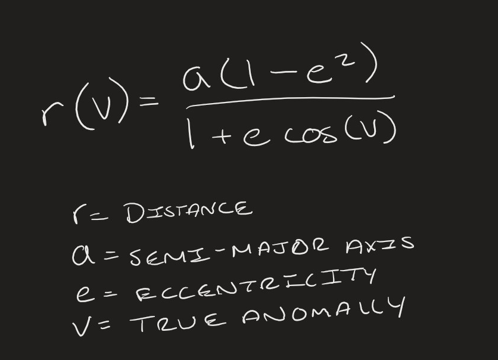
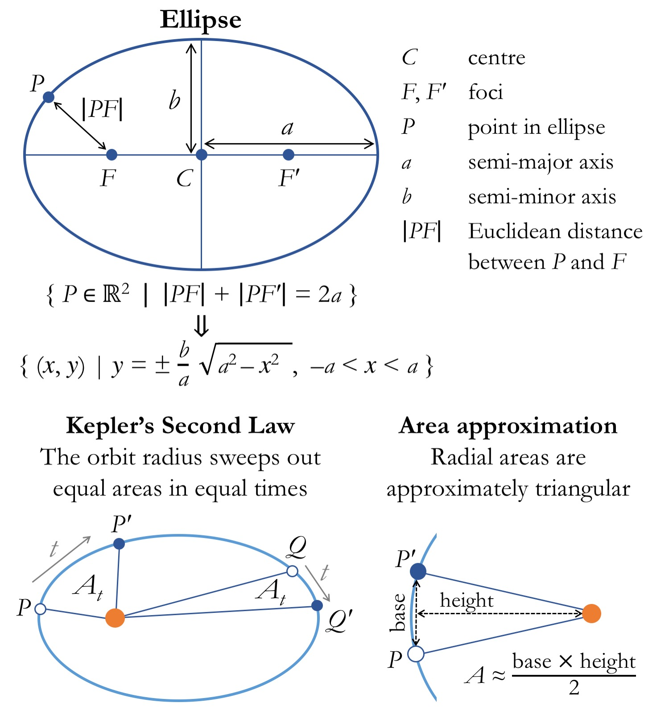

# How our physics works.
## We used Keplerian Orbital Mechanics
### Why Kepler?
- Newton’s Laws describe the gravitational interaction
- Kepler’s laws describe the elliptical orbits
- Simple enough that we didn’t need to keep track of too many variables.
## Kepler’s Laws of Planetary Motion
In simple terms, the three laws can be described as such.
- The orbit of a planet is an ellipse with the Sun at two foci.
- The line segment connecting a planet and the Sun sweeps out equal areas at equal intervals of time.
- The Square of the Orbital period is directly proportional to the cube of the semi-major Axis.
However the formula for such mechanics looks like this…

Which would have taken a long time to translate into code.

But I discovered a useful insight...
