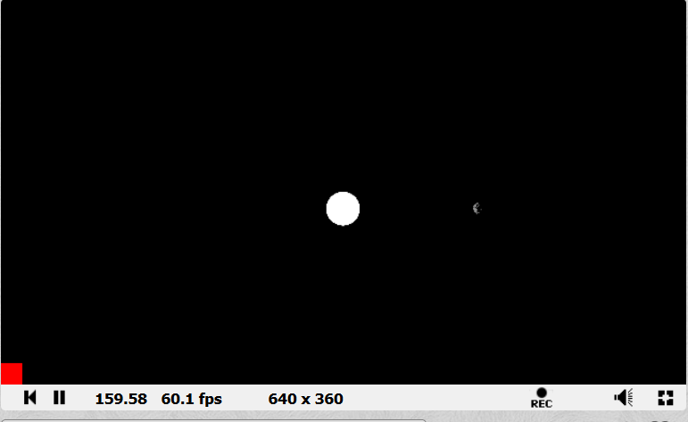
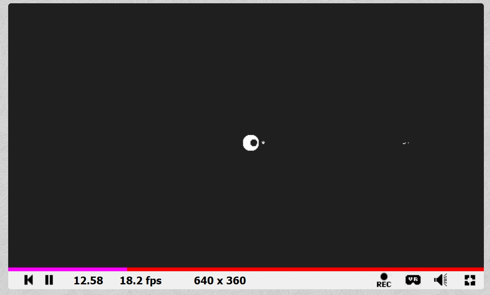

# How our physics works.
## We used Keplerian Orbital Mechanics
### Why Kepler?
- Newton’s Laws describe the gravitational interaction
- Kepler’s laws describe the elliptical orbits
- Simple enough that we didn’t need to keep track of too many variables.
## Kepler’s Laws of Planetary Motion
In simple terms, the three laws can be described as such.
- The orbit of a planet is an ellipse with the Sun at two foci.
- The line segment connecting a planet and the Sun sweeps out equal areas at equal intervals of time.
- The Square of the Orbital period is directly proportional to the cube of the semi-major Axis.
However the formula for such mechanics looks like this…

Which would have taken a long time to translate into code.

But I discovered a useful insight...

## How that translates into code
Kepler’s Laws actually translate well into trigonometry (much simpler)
- Euclidean Distance Function:
  to find the distance between two bodies, that being usually the Sun and another planet.
- Area Carved Function:
  finding base and height of triangle within to orbit points and the sun. Then calculating the area.
- Next Position Function:
  find the next position in the orbit based on the current orbit.
Assumptions and information we had on hand:
- Planetary info based on NASA

## Single Orbit Results

AND SO IT ORBITS!
The red cube is a section of the screen that was used to store the planet position.

## Multiple Orbits Results

And so we could simulate four planets orbiting. Why?
- Mercury and anything beyond Saturn are too small
- Looks ugly and there are integration issues
> Iosef uses ray tracing
> Jiro uses sphere tracing
