# How are Planets were simulated
Jiro Mizuno
## Procedural Generation
- Used UV mapping
- Used perlin noise and multifractal noise

Source:
Texturing and Modeling: A Procedural Approach ed. 3 (Chapter 15)

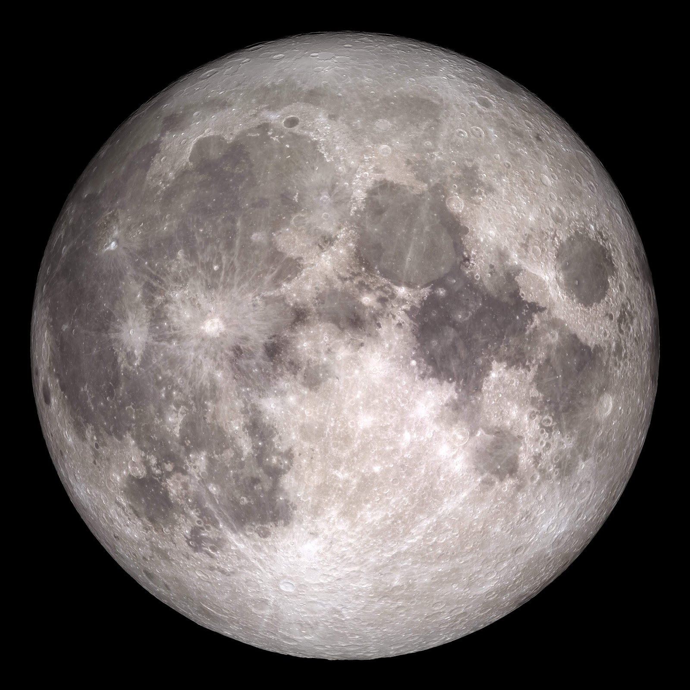
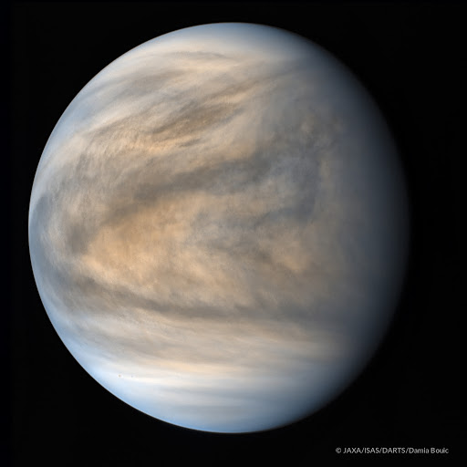
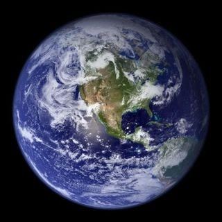

## Earth
### Creating oceans
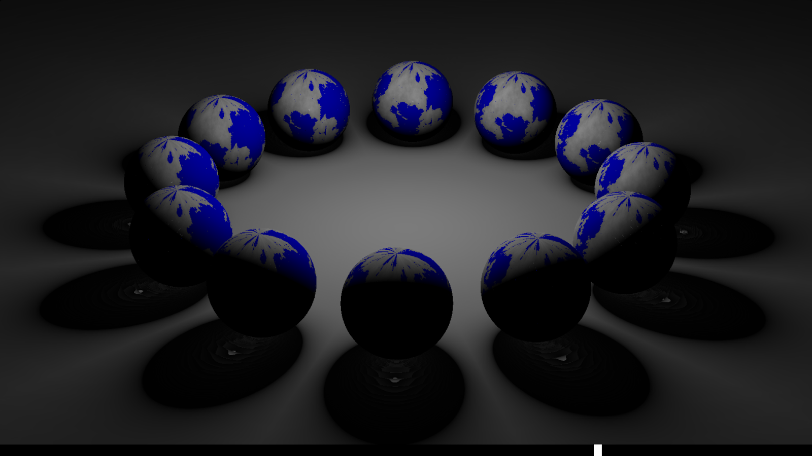

### Ice caps (hiding uv map distortions)
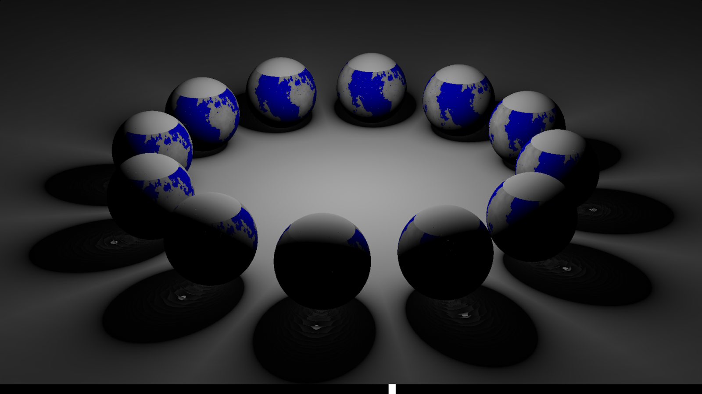

### Varying climate by altitude(noise)
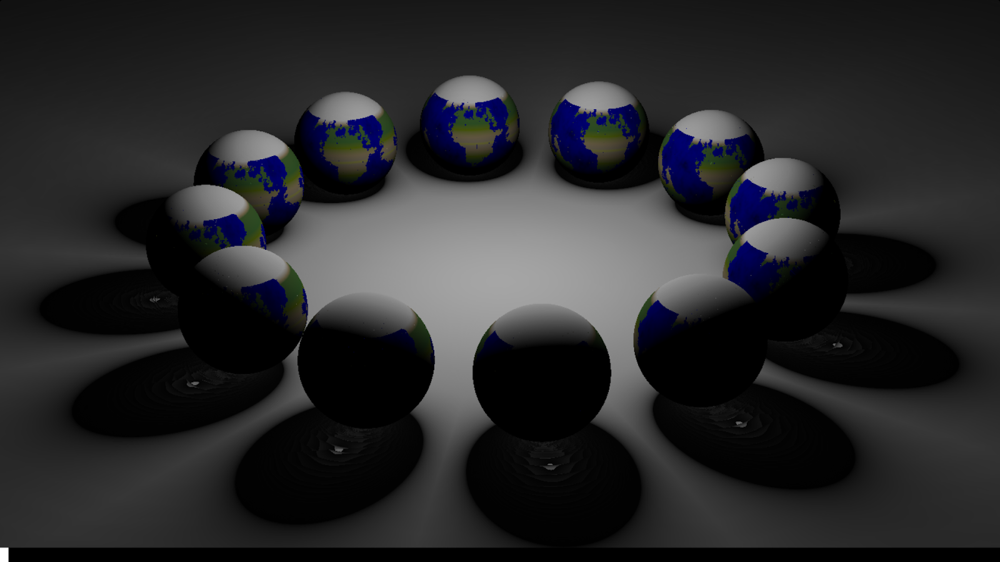

### Muddling land texture with multifractals
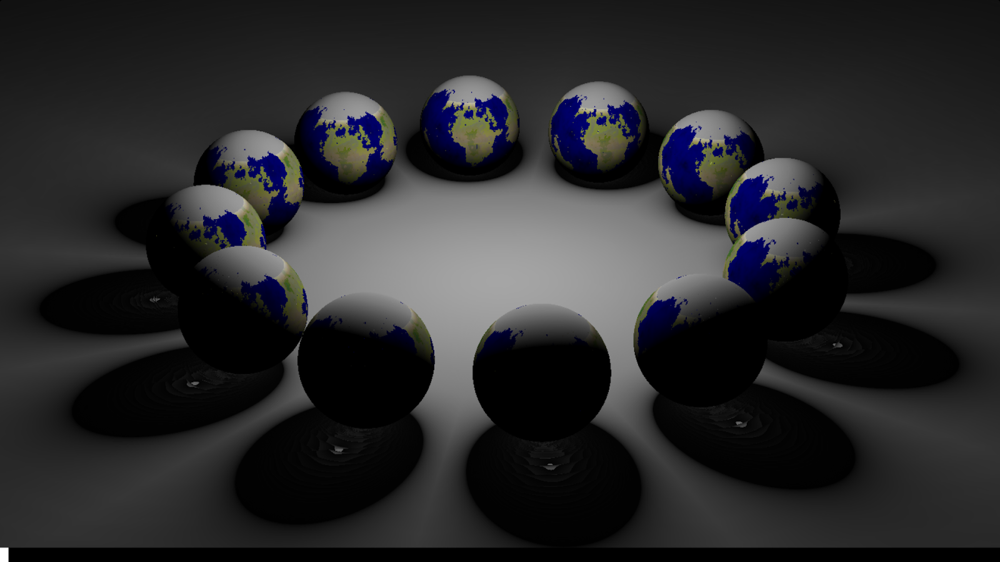

### Unsmoothening the ice caps

### Adding rivers/lakes
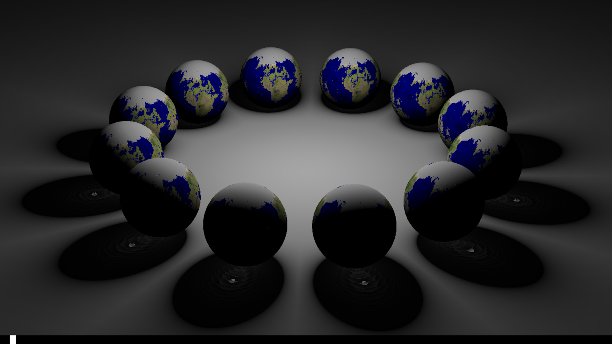

## Gas Giants
**Coriolis Effect**
- Responsible for circular cloud pattern in gas giants + earth

- Can be simulated by rotating perlin noise by the distance from (0,0) on the UV map.

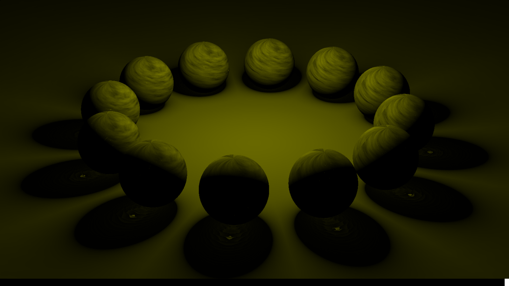

## Coriolis Issues
- My perlin noise is not tileable
- Mitigated a bit by the moving gas constantly
- Assigning a different coriolis focus point for half the map to make it look more pleasant

## Rocky planets (moon)
### Basic moon highland v maria(lunar lowlands)

### Adding crater ring

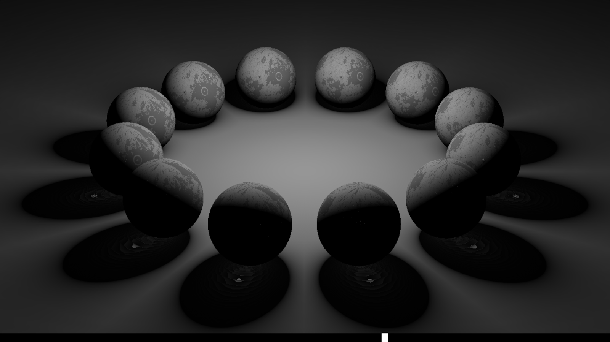

### Adding crater rays

### Adding depth to crater via noise turbulence

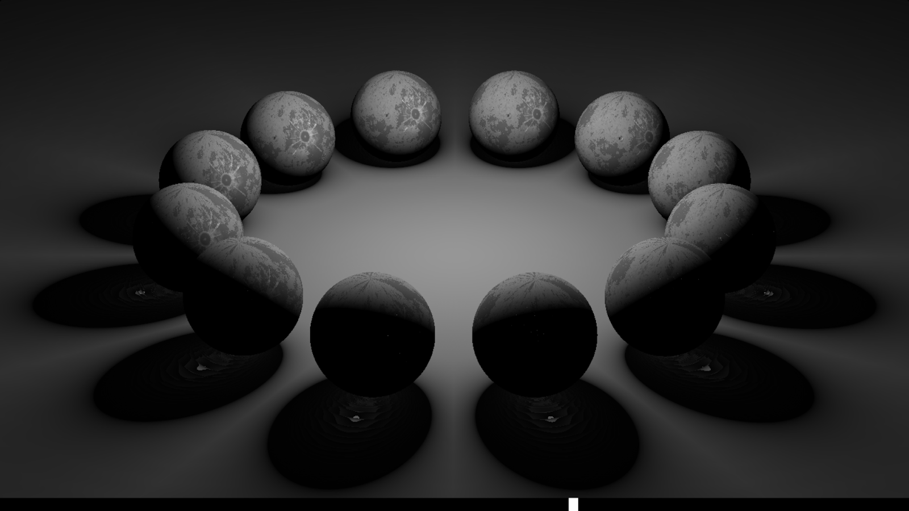
