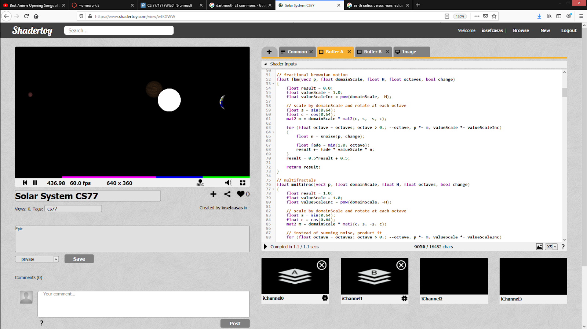

# Solar System simulation
Iosef Casas, Jiro Mizuno

## Project
Simulate the Solar System!
In ShaderToy!

## Initial Goals
Orbital movement:
- Multiple Objects on Ray-Tracing/Sphere-Tracing base
- Single Keplerian Orbit
- Multiple Keplerian Orbits
Procedurally generated texture:
- Earth
- Rocky (the moon)
- Gas
Integrating both: (unseen problems including)
- Integration in general
- Adjusting soft shadow function for the sun
- Camera movement

## Integration Problem: Separate Rendering calculations
- When it came time to combine everything, Jiro was using Sphere-Tracing while Iosef was using slightly Modified Ray-Tracing. Ray-Tracing was slow and incomplete from our assignment base, that we couldn’t load any textures onto it. We were stuck…
- But we realized something, all of the orbital mechanics were offloaded onto buffers and proprietary functions in common. While the shader and textures were on their own buffer and had their own separate common function. Meaning, since Sphere-Tracing was already built for texturing, we only needed to rebuild the Sphere-Tracing base slightly to accommodate orbits and Buf B!

## Adjust Sphere-Tracing with my Orbital Code
- Reuse buffer b calculations
- Adjust functions to sphere tracing
- Make sure channels worked
- Adjust sun to not be an emitting light source (light exists but doesn’t come nor affect sun)

## How to use
- Click link https://www.shadertoy.com/view/wtKXWW
